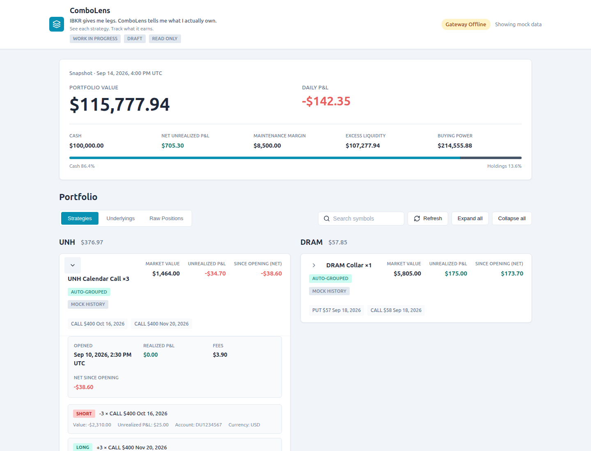

# ComboLens

**Work in progress · Draft V0.1 · Viewer only**

> IBKR gives me legs. ComboLens tells me what I actually own.

ComboLens groups IBKR holdings into understandable strategies and puts their profit and loss in context: what is currently unrealized, and what the strategy has earned since opening. This repository is an unfinished prototype, not a production release.

A local portfolio dashboard that turns normalized Interactive Brokers-style holdings into readable option strategies. The draft runs entirely from a fixed mock snapshot, without an IBKR account. It contains no order submission, modification, cancellation, exercise, or broker account mutation functionality.

## Strategy profit, shown separately

- **Unrealized P&L**: the current gain or loss on the open holdings, as provided in the portfolio snapshot.
- **Since opening (net)**: realized P&L + current unrealized P&L − lifecycle fees, only when complete, compatible opening-history data is available and the reported P&L excludes those fees.
- Expanded strategies show the opening date, realized P&L and fees separately. Market value is the value of the position, not its profit.

The draft uses explicitly synthetic **Mock history** summaries for selected examples. They are a presentation/arithmetic preview, not a reconstructed execution ledger. Missing, incomplete, ambiguous or mismatched history shows **unavailable**, never a fabricated zero. Real brokerage history and commission reconciliation are still to be built.



## Run locally

Prerequisites: Python 3.11+ with venv/pip, Node.js 22.12+ and pnpm 11.25.0. The frontend pins its package manager version.

From the repository root, in the first terminal:

```sh
python3 -m venv .venv
source .venv/bin/activate
python -m pip install -e ".[dev]"
python -m uvicorn apps.api.main:app --host 127.0.0.1 --port 8000
```

In another terminal:

```sh
cd apps/web
pnpm install
pnpm dev --host 127.0.0.1
```

Open http://127.0.0.1:5173. API documentation is at http://127.0.0.1:8000/docs.

The web development server proxies `/api` to FastAPI. The frontend never connects to IBKR Gateway. Keep this unauthenticated draft on localhost.

## Architecture

```text
React / TypeScript / Vite
          ↓ GET /api/v1/*
        FastAPI
          ↓
  PortfolioProvider
          ↓
Mock snapshot (V0.1) / IBKR provider skeleton
          ↓
Normalized positions → pure strategy engine → allocated strategies
```

`packages/portfolio_models` owns Pydantic models. `packages/strategy_engine` consumes those models without any IBKR dependency. Each allocated leg retains its source position ID, signed quantity and prorated valuation. The raw holdings remain unchanged. Account and currency boundaries are preserved when grouping.

The application provides Strategies (default), Underlyings and Raw Positions views. Raw position details expose the full normalized record. Search and expansion are local UI operations; refresh re-reads the API.

## Mock mode

`fixtures/mock_portfolio.json` is a fixed historical snapshot from **September 14, 2026**. Quotes, account metrics and IDs are illustrative, not live market data. Refresh does not advance the snapshot timestamp.

- UNH: Calendar Call ×3, plus 2 shares. Calendar value $1,464; unrealized P&L −$34.70.
- DRAM: 57/58 Collar ×1, backed by 100 shares.
- SPMO and NVDA: one Long Call each.
- QQQ: competing calendar candidates, left unmatched.
- XYZ: incomplete option terms, left unmatched.

Mock portfolio value reconciles to cash plus signed position market values. Buying power and margin are illustrative provider metrics; the strategy engine does not calculate brokerage risk requirements.

## Detection rules

Precedence: Collar → Covered Call → Protective Put → Calendar → Diagonal → Vertical → individual options → remaining stock/unmatched positions.

Stock protections are considered first. Calendars require the same strike/right/multiplier and a near-dated short against a later long. Diagonals use different strikes and expirations; verticals share expiration and right. Quantities greater than one remain grouped. Partial matches leave the remaining quantities visible, and share coverage uses the actual option multiplier.

At each tier, competing eligible matches are left explicitly unmatched. This is intentionally conservative. The engine infers structural relationships; it cannot establish the original trading intent. Confidence describes satisfaction of the rule, not the probability of an investment outcome. Unknown valuations remain null rather than becoming zero.

## API

All five portfolio endpoints are GET-only:

| Endpoint | Result |
| --- | --- |
| `/api/v1/status` | Source, Gateway connection state, snapshot timestamp |
| `/api/v1/account` | Account metrics |
| `/api/v1/positions` | Original normalized positions |
| `/api/v1/strategies` | Allocated strategies, residual stock, unmatched legs |
| `/api/v1/underlyings` | Positions and strategies grouped by underlying |

REST supports future web, PWA and native clients. A future server-to-client snapshot WebSocket contract is documented in `docs/DRAFT_PLAN.md`; V0.1 does not implement WebSockets.

## Verification

```sh
python -m pytest
python -m mypy packages apps/api
python -m ruff check packages apps/api tests
cd apps/web
pnpm typecheck
pnpm build
```

See [validation evidence](docs/VALIDATION.md) and [the draft plan](docs/DRAFT_PLAN.md). See [the initial milestone report](docs/FINAL_REPORT.md), [desktop screenshot](docs/screenshots/desktop-overview.png), and [mobile screenshot](docs/screenshots/mobile-full.png).

For browser acceptance (with both servers running):

```sh
cd tests/browser
pnpm install
pnpm exec playwright install chromium
pnpm test
```

Optional local development containers:

```sh
docker compose up
```

The Compose file publishes only localhost ports. Its YAML and bindings were checked, but containers were not run in the development environment because Docker was unavailable. The direct Python/Node workflow above was tested.

`PORTFOLIO_PROVIDER=mock` is the default. Selecting `ibkr` explicitly raises an unavailable-provider error; there is no silent mock fallback.

## IBKR integration remaining

The live provider is an explicit skeleton. Future work will use a privately encapsulated `ib_async.IB` connection and normalize read-only account, portfolio, position and contract data. `connectAsync(readonly=True)` and the Gateway Read-Only API setting both belong in that integration, with a dedicated client ID. The library's readonly argument alone does not remove its internal trading capabilities; application encapsulation remains necessary.

Live work still requires account selection, contract/deliverable validation, subscription lifecycle, reconnect/resync, delayed/stale quote handling, currency conversion policy and paper-account verification. No live Gateway validation has been performed for this draft.

## Limitations and next phase

This is a single local mock account, with no authentication, persistent transaction ledger, manual grouping overrides, historical analytics, Greeks, rolled-trade reconstruction, FX conversion or adjusted-deliverable support. Numeric sums use floating-point tolerances. Matching priority can favor one interpretation of a complex holding; the raw view remains the audit source. Multiple lots/candidate protections may remain unmatched even where a human can identify intent.

Next priorities are a tested read-only Gateway provider; execution and commission reconciliation; persistent strategy lifecycle IDs across partial closes, additions and rolls; and local grouping overrides with snapshot persistence. See [the ongoing roadmap](docs/ROADMAP.md). Native mobile and production infrastructure are outside the current draft. Trading remains outside the product boundary.

## Project status

The initial strategy-viewer milestone is complete, but **ComboLens is not finished**. The [initial milestone report](docs/FINAL_REPORT.md) records that earlier validation; the [ComboLens milestone notes](docs/COMBOLENS_RELEASE_NOTES.md) describe the rename and strategy-profit preview. Live connectivity and trustworthy real-account lifecycle P&L remain the next major pieces.

## Collaboration and references

Claude is the primary implementation assistant. Codex owns planning, reference inspection, code review, integration and validation. See [reference findings and license notes](docs/REFERENCES.md). No substantial reference source code was copied.
